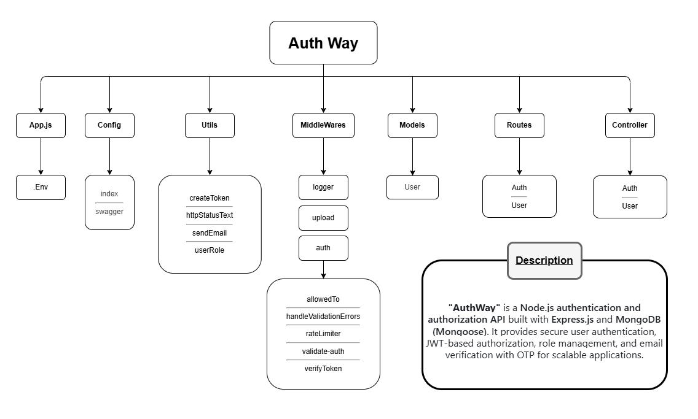

# AuthWay

AuthWay is a **Node.js authentication and authorization API** built with **Express.js** and **MongoDB (Mongoose)**.
It provides secure user authentication, JWT-based authorization, role management, and email verification with OTP for scalable applications.

---

## Features
- User registration and login system.
- JWT-based authentication with refresh token support.
- Password hashing using **bcrypt**.
- Role-based access control (Admin, User).
- Email verification with OTP (One-Time Password).
- “Remember Me” option for persistent sessions.
- Secure environment configuration using **dotenv**.
- Input validation with **express-validator**.
- Interactive API documentation using **Swagger UI**.

---

## Tech Stack
- **Backend:** Node.js, Express.js
- **Database:** MongoDB + Mongoose
- **Authentication:** JWT, bcrypt, OTP verification
- **Validation:** express-validator
- **Docs:** Swagger UI
- **Other Tools:** dotenv, nodemon

---

## Project Structure



---

## Getting Started

1. Clone the repository:
   ```bash
   git clone https://github.com/YourUsername/AuthWay.git
   cd AuthWay

2. Install dependencies:
   ```bash
   npm install

3. Create a .env file in the root directory and add the following:
   ```bash
   PORT=5000
   MONGO_URI=your_mongodb_connection_string
   JWT_SECRET=your_secret_key
   REFRESH_TOKEN_SECRET=your_refresh_token_secret
   EMAIL_USER=your_email@example.com
   EMAIL_PASS=your_email_password

4. Start the server:
   ```bash
   npm start

---

## API Endpoints (Examples)

### Auth

- **POST** /api/auth/register → Register a new user (with avatar upload).
- **GET** /api/auth/verify-email/{token} → Verify user email by token.
- **POST** /api/auth/resend-verification → Resend verification email.
- **POST** /api/auth/login → Login user and return token.
- **POST** /api/auth/verify-otp → Verify user OTP (after login/register).
- **POST** /api/auth/forget-password → Send password reset link.
- **POST** /api/auth/reset-password/{token} → Reset user password using token.
- **POST** /api/auth/logout → Logout user (needs Bearer token).

### Users

- **GET** /api/user/all → Get all users (Admin only).
- **GET** /api/user/me → Get current logged-in user.
- **PUT** /api/user/update → Update current user (with avatar upload).
- **PATCH** /api/user/update → Update user role (Admin only).
- **DELETE** /api/user/delete → Delete current user.

### Docs

- **GET** /api-docs → Open Swagger API documentation.

---

## Future Improvements

- Add 2FA (Two-Factor Authentication via app like Google Authenticator).
- Add social login (Google, GitHub, etc.).
- Build a frontend with React/Next.js.
- Admin dashboard to manage users.

---

## Author

**Saif Eldeen Sobhi**

- LinkedIn: [linkedin.com/in/saif-eldeen-sobhy](https://www.linkedin.com/in/saif-eldeen-sobhy/)  
- Email: saifeldeen409@gmail.com